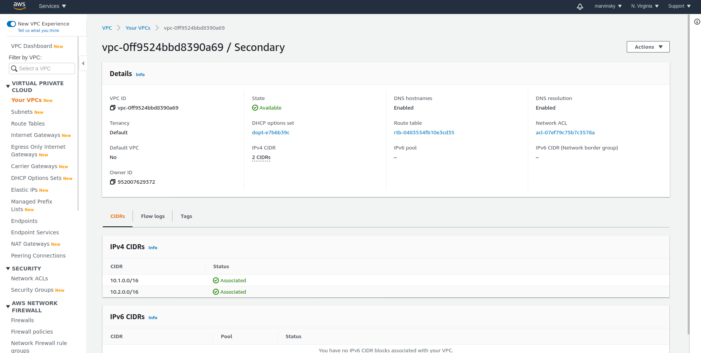
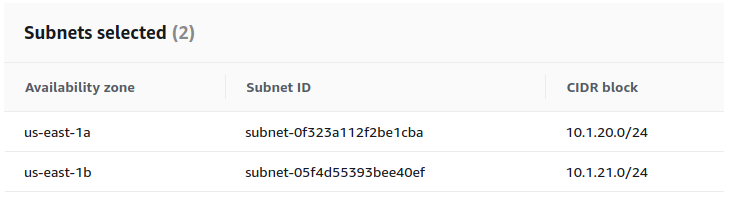
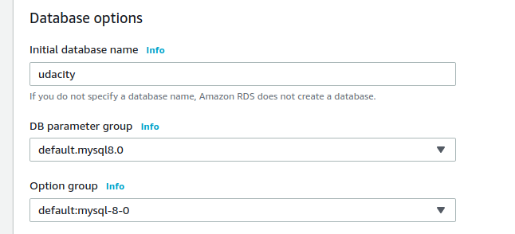

# Aws project that guaranties: Hig Availability, High Reliability, and High Resilence

### Create VPC using YAML file.

### Region

<ol>
<li>Services -> CloudFormation</li>
<li>Create stack "With new resources (standard)"</li>
<li>Template is ready</li>
<li>Upload a template file: https://github.com/Marvinsky/aws_availability_reliability_resilence/cloudformation/vpc.yaml</li>
<li>Fill in Stack Name: <b>Primary</b></li>
<li>Name the VPC: <b>Left it empty</b></li>
<li>Update the CIDR blocks</li>
<li>Click Next -> Next Again -> Click create Stack</li>
<li>Wait for the stack to build out. Refresh until status becomes "CREATE_COMPLETE"</li>
</ol>

### Screenshots: Creation CF & VPC
#### Upload YAML file:

#### CIDR:

#### Outputs:

#### Resources:

### Data Durability and Recovery

<ol>
<li>Pick two AWS regions. An active and standby region</li>
<li>Use CloudFormation to create one VPC in each region. Name the VPC in the active
region "Primary" and name the VPC in the standby region "Secondary"</li>
</ol>
<b>NOTE:</b> <i>Be sure to use different CIDR address ranges for the VPCs</i>

#### Regions:
<ol>
<li>Oregon - Active Region</li>
<li>N.Virginia - Standby Region</li>
</ol>

#### primary VPC:

#### primary VPC detail:

#### secondary VPC:

#### secondary VPC Detail:

### Highly durable RDS Database

<ol>
<li>Create a new RDS Subnet group in the active and standby region
using private subnets.</li>
<li>Create a new MySQL, multi-AZ database in the active region. The database must:
    <ul>
        <li>Be a "burstable" instance class.</li>
        <li>Have only the "UDARR-Database" security group.</li>
        <li>Have an initial database called "udacity"</li>
    </ul>
</li>
<li>Create a read replica database in the standby region. This database
has the same requirements as the database in the active region.</li>
</ol>

<b>SAVE</b> screenshots of the configuration of the databases in the active
and secondary region after they are created. Also, save screenshots
of the configuration of the database subnet groups as well as route tables associated
with those subnets. Name the screenshots:

#### Oregon Region

#### VPC

#### private subnets

#### RDS subnet creation

#### RDS subnet selected

#### MYSQL primary private subnet

#### MYSQL primary automatic backup enabled

#### Private Subnet routing table

#### N.Virginia

#### VPC

#### private subnets

#### RDS subnet creation

#### RDS subnet selected

#### Mysql creation

#### Enable Availability Zone in active region (oregon)

#### Be a "burstable"

#### Name it: udacity

#### Security Group

#### <b>Password</b>: <i>12345678</i>

#### MYSQL secondary private subnet

#### MYSQL secondary automatic backup enabled

#### Private secondary Subnet routing table

#### Primary DB config

#### Secondary DB config

#### PrimaryDB subnet group

#### SecondaryDB subnet group

#### Primary VPC Subnet

#### Secondary VPC Subnet

#### Primary Subnet Routing

#### Secondary Subnet Routing

### Availability Estimate

Write a paragraph or two describing the achievable Recovery Time Objective (RTO) and
Recovery Point Objective (RPO) for this Multi-AZ, multi-region database in terms of:

<ol>
<li>Minimum RTO for a single AZ outage</li>
<li>Minimum RTO for a single region outage</li>
<li>Minimum RPO for a single AZ outage</li>
<li>Minimum RPO for a single region outage</li>
</ol>

<b>SAVE:<b/> <i>estimates.txt</i>

https://github.com/Marvinsky/aws_availability_reliability_resilence/estimates.txt

### Demonstrate Normal Usage

In the active region:

<ol>
<li>Create an EC2 keypair in the region</li>
<li>Launch an Amazon Linux EC2 instance in the active region. Configure
the instance to use the VPC's public subnet and security group ("UDARR-Application")</li>
<li>SSH to the instance and connect to the "udacity" database in the RDS instance</li>
<li>Verify that you can create a table, insert data, and read data from the database</li>
<li>You have now demonstrated that you can read and write to the primary database.</li>
</ol>

<b>SAVE</b>: The log connecting to the database, creating the table,
writing to and reading from the table in a text file called <i>log_primary.txt</i>

#### Amazon Linux EC2 - Creation 00

#### Amazon Linux EC2 - Creation 01

#### Amazon Linux EC2 - Creation 02

#### Amazon Linux EC2 - Creation 03

#### Amazon Linux EC2 - Creation 04

#### Amazon Linux EC2 - Creation 05

#### Amazon Linux EC2 - Creation 06

#### Amazon Linux EC2 - Creation 07

<b>SAVE:<b/> <i>log_primary.txt</i>

https://github.com/Marvinsky/aws_availability_reliability_resilence/log_primary.txt

### Monitor database

<ol>
<li>Observe the "DB Connections" to the database and how this metric
changes as you connect to the database</li>
<li>Observe the "Replication" configuration with your multi-region read replica</li>
</ol>

#### Monitor Connection - udacity

#### Monitor Replication - udacity

### Failover And Recovery

In the standby region

<ol>
<li>Create an EC2 keypair in the region</li>
<li>Launch an Amazon Linux EC2 instance in the standby region. Configure the instance to use the VPC's public subnet and security group ("UDARR-Application").
</li>
<li>SSH to the instance and connect to the read replica database.</li>
<li>Verify if you are not able to insert data into the database but are able to read from the database.</li>
<li>You have now demonstrated that you can only read from the read replica database.</li>
</ol>

<b>SAVE:</b> log_rr_before_promotion.txt

#### RR before promotion

#### Promote read replica in order to make insertion

#### RR after promotion

### Website Resiliency

Build a resilient static web hosting in AWS. Create a versioned S3 bucket and
configure it as a static website.

<ol>
<li>Enter "index.html" for both index document and Error document</li>
<li>Upload the files from the GitHub repo (under <b>/project/s3/</b>)</li>
<li>Paste URL into a web browser to see your website</li>
</ol>

#### S3 bucket creation

#### S3 bucket enable public access for file.

#### S3 Original

#### S3 Season

#### S3 Season Revert

#### S3 Deletion

#### S3 Delete Marker

#### S3 Delete Revert

